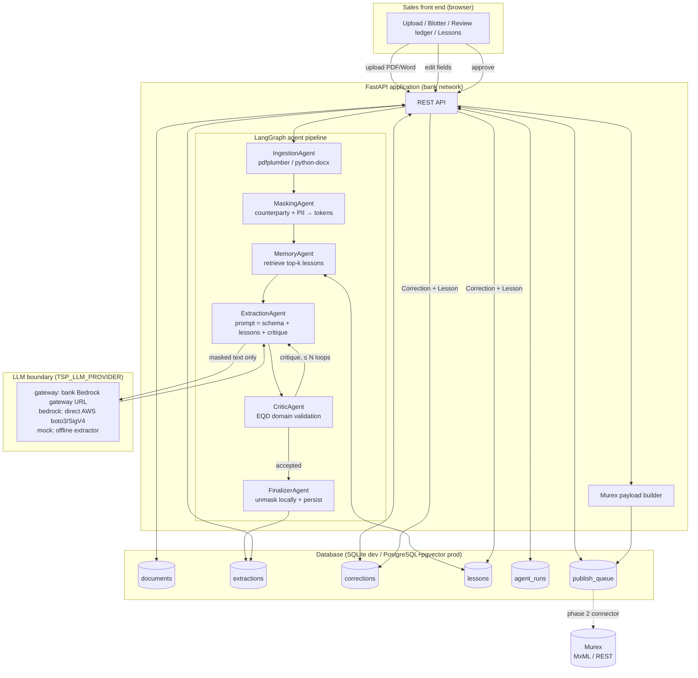
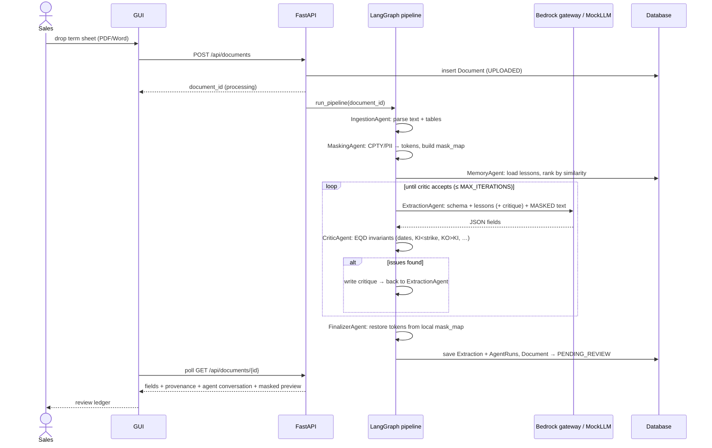
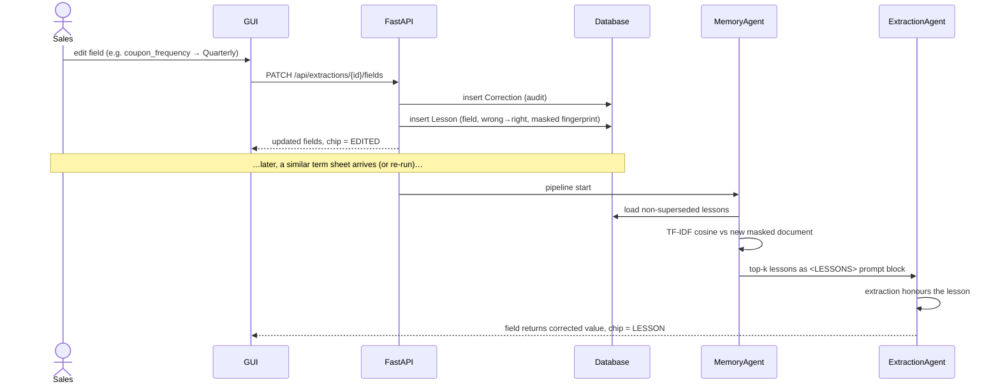
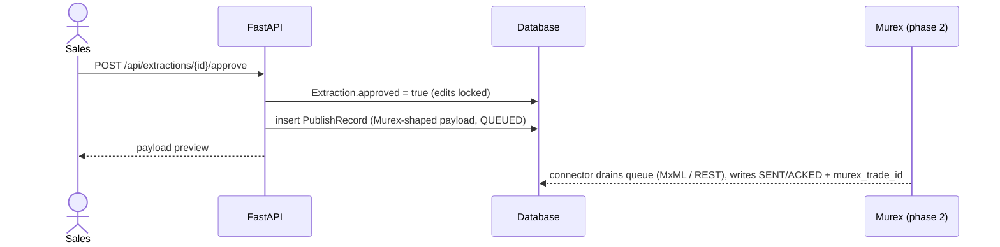

# Architecture

## 1. Overview

The system converts dealer term sheets for EQD structured products
(FCN, BEN, Phoenix/autocallable notes with knock-out and knock-in features)
into structured, review-approved trade data destined for Murex.

Three design constraints shaped it:

1. **Sensitive data must not cross the office network.** Masking runs
   locally *before* any text reaches the LLM gateway; unmasking runs locally
   *after* the response returns. The token→value map is only ever persisted
   in the bank-side database.
2. **The system must improve with use.** Every manual correction by sales is
   converted into a durable *lesson* that is retrieved and injected into the
   extraction prompt of future, similar documents.
3. **Every automated decision must be explainable.** The critic uses
   deterministic EQD domain rules (not a second opaque LLM vote), and the
   full agent conversation is persisted and rendered in the GUI.

## 2. Component / flow diagram



**The security boundary:** only the `masked_text` string crosses to the
gateway. `raw_text` and `mask_map` never appear in any prompt.

## 3. Sequence diagram — upload → review



## 4. Sequence diagram — feedback learning loop



## 5. Sequence diagram — approval → Murex



## 6. The agents

| Agent | Responsibility | Key detail |
|---|---|---|
| **IngestionAgent** | PDF/Word → text | pdfplumber page text **and** table rows (`a \| b \| c`), python-docx paragraphs + tables |
| **MaskingAgent** | Remove sensitive data pre-LLM | Ordered passes: emails → SWIFT/BIC → accounts → phones → counterparty legal names (word-bounded, longest-first, entity-suffix aware) → contact-line person names. Same entity ⇒ same token. Economics (tickers, barriers, dates) deliberately untouched |
| **MemoryAgent** | Self-learning retrieval | Ranks all active lessons against the masked document (TF-IDF cosine; pgvector embeddings in production) and formats the top-k as a `<LESSONS>` prompt block. Also records new lessons from corrections |
| **ExtractionAgent** | LLM extraction | Prompt = system rules + field schema (from `schemas.py`, descriptions are the contract) + lessons + optional critic feedback + masked text. Parses robust JSON |
| **CriticAgent** | Self-review | Deterministic EQD invariants: required fields, `trade ≤ fixing ≤ issue ≤ final ≤ maturity`, `KI < 100`, `KI ≤ strike`, `KO > KI`, coupon ∈ (0, 60] % p.a., ISO currency, underlyings named, autocall⇒KO. On failure writes a critique and loops back (≤ `TSP_MAX_CRITIC_ITERATIONS`) |
| **FinalizerAgent** | Unmask + persist | Restores `[CPTY_n]`-style tokens in counterparty/issuer/calculation-agent fields using the **local** mask map, saves the extraction with per-field provenance, flips the document to `PENDING_REVIEW` |

The Extraction ⇄ Critic loop is the "agents talking to themselves"
conversation; every turn is persisted as an `AgentRun` and shown in the GUI
timeline.

## 7. Data model

```
documents      1 ──▶ * extractions ──▶ * corrections
documents      1 ──▶ * agent_runs
extractions    1 ──▶ * publish_queue
lessons        (independent; linked to context via masked fingerprint,
                referenced by extractions.lessons_used)
```

Why this database design for self-learning:

* **Lessons are first-class rows**, not prompt hacks — auditable, countable
  (`times_applied`), reversible (`superseded` flag instead of deletion).
* **The fingerprint is the masked text**, so similarity search never touches
  sensitive values and lessons transfer across counterparties that use the
  same template dialect.
* **Per-field provenance** (`field_meta`) lets the GUI show *why* a value is
  what it is (LLM / LESSON / EDITED) — trust is a feature.
* Production: PostgreSQL + **pgvector**; swap `services/similarity.py`
  for an embedding + `ORDER BY embedding <=> query` and everything else is
  unchanged.

## 8. Framework choices

* **LangGraph** — explicit state graph with a conditional critic loop;
  the pipeline is testable node-by-node and the state is a plain dict.
* **FastAPI + SQLAlchemy** — typed API, background pipeline execution,
  SQLite→PostgreSQL portability.
* **Provider-switchable LLM client** — `TSP_LLM_PROVIDER` selects bank
  gateway (HTTP+key), direct AWS Bedrock (boto3 Converse API, SigV4/IAM
  credential chain, optional VPC endpoint), or the deterministic MockLLM —
  behind one `complete(prompt)` interface. The whole system (including the
  learning loop) runs and is CI-tested offline; flipping providers is an
  environment variable, not a code change, and explicit misconfiguration
  fails loudly instead of silently degrading to mock.
* **Zero-build front end** — no npm, no CDN fonts/scripts; deploys inside a
  locked-down bank network as static files served by the API.
